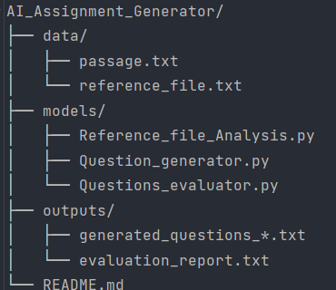

#### This repository processes question generation and evaluation based on a reference file and user-provided passages.

# Overview

### Reference File Analysis
- **Reference_file_Analysis.py** reads and analyzes **reference_file.txt** to extract key information and the format of the questions.

### Question Generation
- **Question_generator.py** uses the processed reference data (from Step 1) and the user-provided passage from **passage.txt** to generate questions.
- Generated questions are saved in the **outputs/** directory.

### Question Evaluation
- **Questions_evaluator.py** reads the generated questions from the **outputs/** directory.
- Evaluation results are also stored in the **outputs/** directory.

> **Note:** Currently, the question generation module saves the output in a timestamp format and simultaneously updates the output file so that the question evaluation module can generate a report on the latest data. In the future, this process could be automated.

### Project Structure

### Usage
**Prepare Input Files**
   - Place your reference content in data/reference_file.txt.
   - Place your passage in data/passage.txt.

**Analyze the Reference**
   - Run python models/Reference_file_Analysis.py.

**Generate Questions**
   - Run python models/Question_generator.py.
   - The generated questions will appear in outputs/.

**Evaluate the Questions**
   - Run python models/Questions_evaluator.py.
   - The evaluation report will be saved in outputs/.
   
### Requirements
- **Python 3.7+** (or your preferred version)
- **Some of the Main libraries used:**
  - NumPy
  - Pandas
  - NLTK for natural language processing
  - spaCy for linguistic analysis
  - TextBlob for sentiment analysis
  - Python's built-in tools for text processing

### Contributing
1. Fork the repository.
2. Create a feature branch.
3. Commit your changes.
4. Push to your branch.
5. Create a Pull Request.

### Evaluation Metrics
The project provides detailed metrics on:
- Grammar quality
- Question difficulty
- Technical content
- Similarity to reference questions
- Overall question distribution

